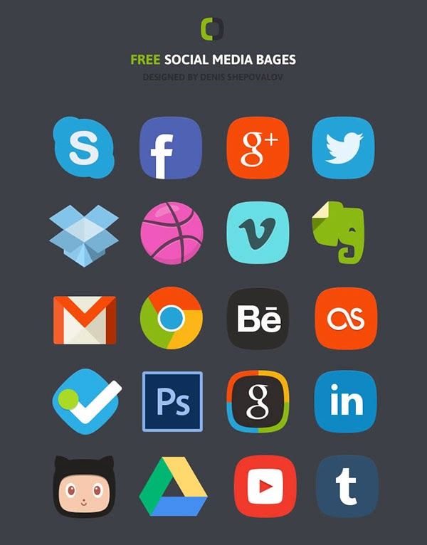
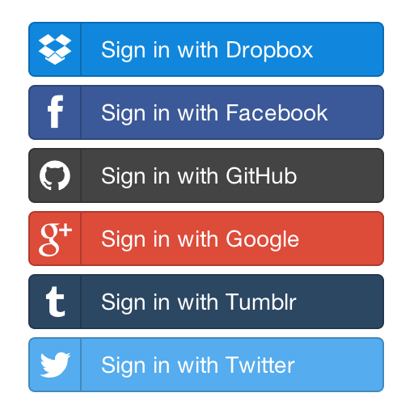
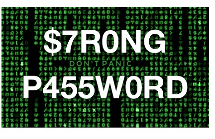
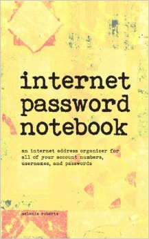

% Managing credentials
% Marc-Antoine Perennou - Clever Cloud
% 9 February 2016  

-------------------------------------------

## Lots of services

-------------------------------------------

## What about authentication?

-------------------------------------------

## Third-party providers

-------------------------------------------

## The easy way

-------------------------------------------

## NOPE

-------------------------------------------

## Use more than one username

-------------------------------------------

## Passwords?

-------------------------------------------

## The (random) seed technique

-------------------------------------------

## /!\\ Danger /!\\

-------------------------------------------

## The safe way

-------------------------------------------

## Password generation

-------------------------------------------

## Password manager

-------------------------------------------

## Credentials manager

-------------------------------------------

## Bonus - 2FA

-------------------------------------------

## Questions?

<http://clever-cloud.com>

<http://www.imagination-land.org>

[Marc-Antoine@Perennou.bzh](mailto:Marc-Antoine@Perennou.bzh)

[\@Keruspe](https://twitter.com/Keruspe)

[Keruspe on github](https://github.com/Keruspe)

